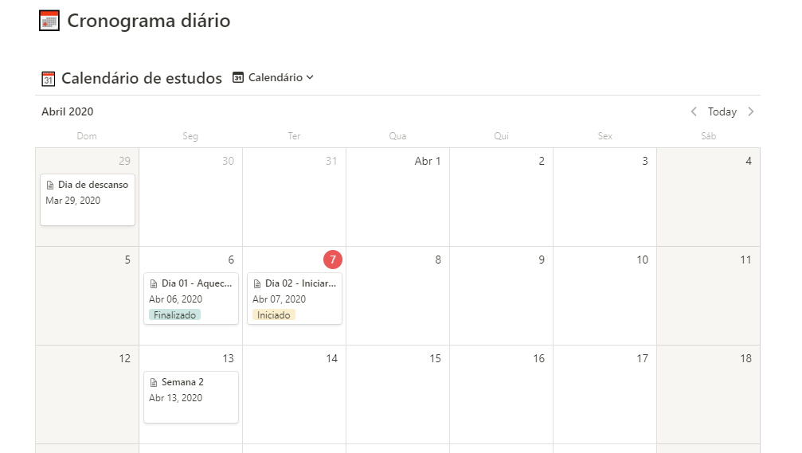
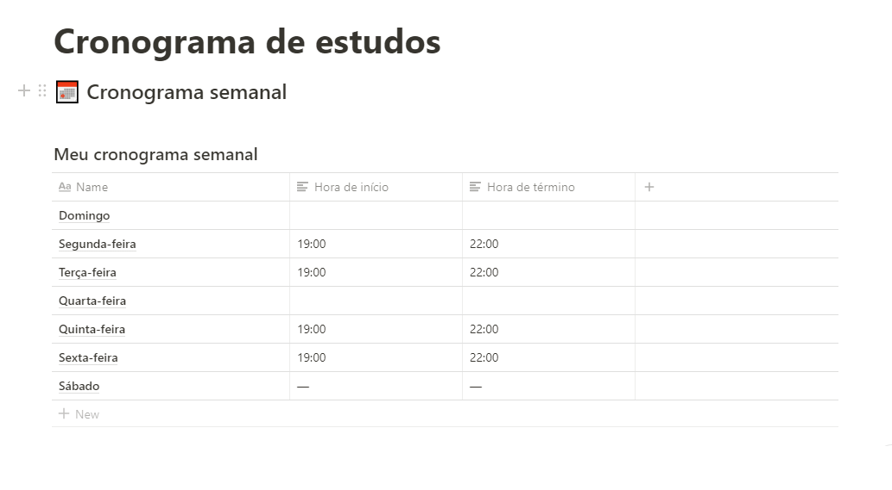

<h3 align="center">
  Desafio 1: Planejando meus estudos
</h3>

“Sua única limitação é você mesmo”!</blockquote>

  

  

  

  

  <a href="#rocket-sobre-o-desafio">Sobre o desafio</a>&nbsp;&nbsp;&nbsp;|&nbsp;&nbsp;&nbsp;
  <a href="#calendar-entrega">Entrega</a>&nbsp;&nbsp;&nbsp;|&nbsp;&nbsp;&nbsp;
  <a href="#memo-licença">Licença</a>

## :rocket: Sobre o desafio

Nesse desafio, tive que planejar os meus estudos.

Para isso, criei um cronograma.

Defini meu horário de estudo, criando tarefas que estarão atreladas a um calendário, para se manter com foco e sempre alinhado com meus objetivos!

### Modelo de cronograma que usei

O Notion funciona tanto em plataformas mobile, tanto em plataformas desktop, e ambas podem ser baixadas em sua [página oficial](https://www.notion.so/product).

📄 **[Link para o modelo](https://www.notion.so/Cronograma-de-estudos-e390bc8d2f5743668ec03348a3306070)**

### Definindo o cronograma semanal

  

Nessa sessão você deve informar os horários fixos que você irá se dedicar durante a sua jornada como programador, afinal, a rotina de estudos será o primeiro passo para você conseguir atingir os seus objetivos o mais rápido possível!

### Definindo o cronograma diário

  

Agora posso planejar minhas tarefas diárias para que eu consiga estar preparado para todo o conteúdo que irá consumir durante a semana.

